import Callout from "@/components/Callout.astro";
import { Picture } from "astro:assets";
import uuidStructure from "./assets/uuid_structure.png";
import collisionProbability from "./assets/collision_probability.png";
import bitManipulation from "./assets/bit_manipulation.png";
import {
  PerformanceComparisonChart,
  StorageComparisonChart,
} from "@components/react/charts/UUIDBenchmarkCharts";
import {
  PerformanceStorageScatterChart,
  MultiMetricRadarChart,
} from "@components/react/charts/UUIDAdvancedCharts";

## Introduction

When building distributed systems or high-performance applications, generating unique identifiers efficiently is crucial. The landscape of time-ordered identifiers has evolved significantly, with UUIDv7, ULID, and TypeID each offering unique advantages for different use cases. PostgreSQL 18's new native UUIDv7 support fundamentally changes the performance equation, making time-ordered identifiers a compelling choice for most applications.

In this comprehensive analysis, we'll explore four UUIDv7 implementations (including PostgreSQL 18's native function), ULID and TypeID alternatives, and provide practical guidance for choosing the right approach for your PostgreSQL applications. Our benchmarks reveal that PostgreSQL 18's native UUIDv7 offers the best of both worlds: excellent performance and guaranteed time ordering.

<Callout type="info">
  **TL;DR:** PostgreSQL 18's native **uuidv7() outperforms all alternatives** with 58.1 μs generation time and 34,127 IDs/sec throughput—making it the clear winner for time-ordered identifiers. For PostgreSQL < 18, custom UUIDv7 implementations remain excellent choices. UUIDv4 still leads in pure concurrent throughput (29,492 IDs/sec) but lacks time ordering.
</Callout>

## Understanding UUIDv7

Before diving into implementations, let's understand what makes UUIDv7 special. Unlike its predecessor UUIDv4 (which is completely random), UUIDv7 incorporates a timestamp, making it naturally sortable by creation time.

<Picture
  src={uuidStructure}
  alt="UUIDv7 Structure showing 48-bit timestamp, version bits, and random components"
/>

The structure consists of:

- **48 bits**: Unix timestamp in milliseconds
- **4 bits**: Version field (0111 binary = 7)
- **12 bits**: Random data or sub-millisecond precision
- **2 bits**: Variant field
- **62 bits**: Additional random data

This design provides both temporal ordering and sufficient randomness to prevent collisions.

## UUIDv7 Implementation Approaches

### PostgreSQL 18 Native Implementation

PostgreSQL 18 introduces native `uuidv7()` support with RFC 9562 compliance:

```sql
-- PostgreSQL 18+ native function
SELECT uuidv7();
-- Output: 01976408-e525-78fb-889c-818826fc412f

-- Optional time parameter for historical UUIDs
SELECT uuidv7('2024-01-01 00:00:00'::timestamp);

-- Extract timestamp from any UUIDv7
SELECT uuid_extract_timestamp('01976408-e525-78fb-889c-818826fc412f'::uuid);
-- Output: 2024-12-06 10:30:45.637+00
```

**Native Implementation Features:**

- **C-level performance**: Direct PostgreSQL core implementation
- **12-bit sub-millisecond precision**: Uses rand_a field for timestamp fraction
- **Monotonicity guarantee**: Ensures ordering within same database session
- **Built-in extraction functions**: `uuid_extract_timestamp()`, `uuid_extract_version()`
- **RFC 9562 compliance**: Follows latest UUID standard published May 2024

#### PostgreSQL 18 Native Analysis

| Aspect   | Assessment                                                                                                                                                                                               |
| -------- | -------------------------------------------------------------------------------------------------------------------------------------------------------------------------------------------------------- |
| **Pros** | • **Best performance** (C-level implementation)<br/>• **Sub-millisecond precision** with monotonicity<br/>• **Future-proof** with official support<br/>• **Built-in utilities** for timestamp extraction |
| **Cons** | • **PostgreSQL 18+ only** (late 2025 release)<br/>• Limited customization vs custom functions                                                                                                            |

## Custom UUIDv7 Implementations (PostgreSQL < 18)

Let's examine each implementation in detail:

### Implementation 1: The Overlay Method (PL/pgSQL)

```sql
CREATE OR REPLACE FUNCTION uuid_generate_v7()
RETURNS uuid
AS $$
BEGIN
  -- use random v4 uuid as starting point (which has the same variant we need)
  -- then overlay timestamp
  -- then set version 7 by flipping the 2 and 1 bit in the version 4 string
  RETURN encode(
    set_bit(
      set_bit(
        overlay(uuid_send(gen_random_uuid())
                placing substring(int8send(floor(extract(epoch from clock_timestamp()) * 1000)::bigint) from 3)
                from 1 for 6
        ),
        52, 1
      ),
      53, 1
    ),
    'hex')::uuid;
END
$$
LANGUAGE plpgsql
VOLATILE;
```

This implementation:

1. Generates a random UUIDv4 as the base
2. Extracts the current timestamp in milliseconds
3. Overlays the timestamp onto the first 48 bits
4. Sets the version bits to make it a valid UUIDv7

#### Implementation 1 Analysis

| Aspect   | Assessment                                                                                                                       |
| -------- | -------------------------------------------------------------------------------------------------------------------------------- |
| **Pros** | • Clear, readable implementation<br/>• Leverages PostgreSQL's built-in UUID generation<br/>• Good performance for most use cases |
| **Cons** | • PL/pgSQL overhead<br/>• No sub-millisecond precision                                                                           |

### Implementation 2: The SQL Method

```sql
CREATE FUNCTION uuidv7_custom() RETURNS uuid
AS $$
  -- Replace the first 48 bits of a uuidv4 with the current
  -- number of milliseconds since 1970-01-01 UTC
  -- and set the "ver" field to 7 by setting additional bits
  SELECT encode(
    set_bit(
      set_bit(
        overlay(uuid_send(gen_random_uuid()) placing
          substring(int8send((extract(epoch from clock_timestamp())*1000)::bigint) from 3)
          from 1 for 6),
        52, 1),
      53, 1), 'hex')::uuid;
$$ LANGUAGE sql VOLATILE;
```

This is essentially the same algorithm as Function 1, but implemented as a pure SQL function.

#### Implementation 2 Analysis

| Aspect   | Assessment                                                                                   |
| -------- | -------------------------------------------------------------------------------------------- |
| **Pros** | • No PL/pgSQL overhead<br/>• Slightly better performance<br/>• Same simplicity as Function 1 |
| **Cons** | • No sub-millisecond precision<br/>• Less readable due to nested function calls              |

### Implementation 3: Sub-millisecond Precision

```sql
CREATE FUNCTION uuidv7_sub_ms() RETURNS uuid
AS $$
SELECT encode(
  substring(int8send(floor(t_ms)::int8) from 3) ||
  int2send((7<<12)::int2 | ((t_ms-floor(t_ms))*4096)::int2) ||
  substring(uuid_send(gen_random_uuid()) from 9 for 8)
, 'hex')::uuid
FROM (SELECT extract(epoch from clock_timestamp())*1000 as t_ms) s
$$ LANGUAGE sql VOLATILE;
```

This implementation builds the UUID from scratch:

1. Extracts timestamp with fractional milliseconds
2. Uses the fractional part for sub-millisecond precision
3. Manually constructs the UUID by concatenating components

#### Implementation 3 Analysis

| Aspect   | Assessment                                                                                                                                              |
| -------- | ------------------------------------------------------------------------------------------------------------------------------------------------------- |
| **Pros** | • Sub-millisecond precision improves ordering within the same millisecond<br/>• Better for high-frequency UUID generation<br/>• Pure SQL implementation |
| **Cons** | • More complex implementation<br/>• Slightly higher CPU usage<br/>• Less random bits (62 vs 74)                                                         |

### Implementation Flow Overview


## Bit Manipulation Visualization

To better understand how Function 1 and 2 work, here's a visual representation of the bit manipulation process:

<Picture
  src={bitManipulation}
  alt="Step-by-step visualization of bit manipulation in UUIDv7 generation"
/>

## Performance Benchmarks

To provide real-world performance data, I created a comprehensive benchmark suite testing:

- Single-threaded performance
- Concurrent generation under load
- Collision resistance
- Time ordering accuracy

The full benchmark code is available at [github.com/spa5k/uuidv7-postgres-benchmark](https://github.com/spa5k/uuidv7-postgres-benchmark).

### Comprehensive Benchmark Results

Based on comprehensive testing with 5,000 iterations per implementation across PostgreSQL 17 and 18:

#### Single-threaded Performance (microseconds)

| Implementation         | PostgreSQL 17 | PostgreSQL 18 | Performance vs UUIDv4 |
| ---------------------- | ------------- | ------------- | --------------------- |
| **Native uuidv7()**    | N/A           | **58.1 μs**   | **32.7% faster**      |
| **uuid_generate_v7()** | 72.3 μs       | 72.3 μs       | 16.2% faster          |
| **uuidv7_custom()**    | 82.3 μs       | 82.3 μs       | 4.7% faster           |
| **UUIDv4 (baseline)**  | 86.3 μs       | 86.3 μs       | Baseline              |
| **uuidv7_sub_ms()**    | 90.6 μs       | 90.6 μs       | 5.0% slower           |

#### Concurrent Throughput (5 workers, UUIDs/second)

| Implementation         | PostgreSQL 17 | PostgreSQL 18 | Performance vs UUIDv4 |
| ---------------------- | ------------- | ------------- | --------------------- |
| **Native uuidv7()**    | N/A           | **34,127**    | **15.7% faster**      |
| **UUIDv4 (baseline)**  | 29,492        | 29,492        | Baseline              |
| **uuid_generate_v7()** | 18,126        | 18,126        | 38.5% slower          |
| **uuidv7_custom()**    | 25,085        | 25,085        | 14.9% slower          |
| **uuidv7_sub_ms()**    | 21,658        | 21,658        | 26.6% slower          |

#### Time Ordering Accuracy

| Implementation         | Ordering Accuracy | Notes                                      |
| ---------------------- | ----------------- | ------------------------------------------ |
| **Native uuidv7()**    | **99.97%**        | **Best** - guaranteed session monotonicity |
| **uuidv7_sub_ms()**    | 99.9%             | Excellent due to sub-ms precision          |
| **uuid_generate_v7()** | 99.7%             | Very good for most uses                    |
| **uuidv7_custom()**    | 99.7%             | Same as PL/pgSQL implementation            |

### Key Findings

1. **PostgreSQL 18 native uuidv7() is the clear winner** - fastest in both single-threaded and concurrent scenarios
2. **Native implementation breaks the performance trade-off** - time ordering AND better performance than UUIDv4
3. **Custom implementations remain excellent** for PostgreSQL < 18 with 18K+ IDs/second throughput
4. **All implementations maintain excellent time ordering** with >99.7% accuracy
5. **Zero collisions detected** in 50,000 UUID generation tests across all implementations

<Callout type="success">
  **Performance Note:** PostgreSQL 18's native uuidv7() delivers 34,127 UUIDs
  per second with guaranteed time ordering - making it the optimal choice for
  new applications. Custom implementations remain excellent for existing
  PostgreSQL installations.
</Callout>

## Collision Probability Analysis

One concern with UUIDs is collision probability. Here's how our implementations compare:

<Picture
  src={collisionProbability}
  alt="Graph showing collision probability vs generation rate for different implementations"
/>

Key insights:

- **Native uuidv7()**: 62 bits of randomness + 12-bit sub-millisecond precision
- **Custom implementations 1 & 2**: 74 bits of randomness
- **Custom implementation 3**: 62 bits of randomness
- Even at 1 billion UUIDs per millisecond, collision probability remains negligible
- **Native implementation's monotonicity guarantee** provides additional collision protection

## Choosing the Right Implementation

Here's a decision matrix to help you choose:

### Use PostgreSQL 18 Native uuidv7() when:

- **You're using PostgreSQL 18+** (available late 2025)
- **You want the best performance AND time ordering**
- You need guaranteed monotonicity within sessions
- You prefer official, maintained implementations
- You want built-in timestamp extraction functions

### Use Custom Implementation 1 (uuid_generate_v7) when:

- You're on PostgreSQL < 18
- You prefer readable, maintainable code
- You're already using PL/pgSQL functions
- Performance is good enough (>18K UUIDs/sec concurrent)
- You want a well-documented approach

### Use Custom Implementation 2 (uuidv7_custom) when:

- You're on PostgreSQL < 18
- You prefer pure SQL functions
- You want balanced performance
- You don't need sub-millisecond precision

### Use Custom Implementation 3 (uuidv7_sub_ms) when:

- You're on PostgreSQL < 18
- You need sub-millisecond time precision
- You're generating many UUIDs within the same millisecond
- Time ordering accuracy is paramount
- You can accept slightly lower performance

## Implementation Recommendations

### 1. Indexing Strategy

```sql
-- Create a B-tree index for time-based queries
CREATE INDEX idx_uuid_time ON your_table (id);

-- For composite indexes, put UUID first if it's the primary filter
CREATE INDEX idx_uuid_status ON your_table (id, status);
```

### 2. Migration from UUIDv4

```sql
-- Add new column
ALTER TABLE your_table ADD COLUMN new_id uuid DEFAULT uuidv7_custom();

-- Migrate existing data (optional)
UPDATE your_table SET new_id = uuidv7_custom() WHERE new_id IS NULL;

-- Switch primary key
ALTER TABLE your_table DROP CONSTRAINT your_table_pkey;
ALTER TABLE your_table ADD PRIMARY KEY (new_id);
```

### 3. Monitoring Performance

```sql
-- Track UUID generation performance
CREATE OR REPLACE FUNCTION benchmark_uuid_generation(
  func_name TEXT,
  iterations INT DEFAULT 1000
) RETURNS TABLE (
  avg_microseconds NUMERIC,
  total_seconds NUMERIC
) AS $$
DECLARE
  start_time TIMESTAMP;
  end_time TIMESTAMP;
BEGIN
  start_time := clock_timestamp();

  EXECUTE format('SELECT %I() FROM generate_series(1, %s)', func_name, iterations);

  end_time := clock_timestamp();

  RETURN QUERY SELECT
    EXTRACT(EPOCH FROM (end_time - start_time)) * 1000000 / iterations,
    EXTRACT(EPOCH FROM (end_time - start_time));
END;
$$ LANGUAGE plpgsql;
```

## Production Considerations

### High Availability

All three functions are deterministic based on system time, making them safe for:

- Read replicas
- Logical replication
- Multi-master setups (with proper clock synchronization)

### Clock Synchronization

<Callout type="warning">
  **Important:** UUIDv7 relies on accurate system time. Ensure your servers use
  NTP synchronization to prevent time drift, which could affect ordering.
</Callout>

### Storage Optimization

UUIDs are 128-bit values, stored as 16 bytes in PostgreSQL. For large tables:

- Consider using BRIN indexes for time-range queries
- Partition by time ranges that align with your UUID timestamps
- Use `CLUSTER` periodically to maintain physical ordering

## Enhanced Performance Analysis: UUIDv4 Baseline Comparison

To provide complete context, let's examine how our UUIDv7 implementations compare against PostgreSQL's native UUIDv4 generation (`gen_random_uuid()`). This baseline comparison helps quantify the performance trade-offs when choosing time-ordered identifiers.

### Performance Comparison Charts

<PerformanceComparisonChart client:load />

### Updated Performance Results (Including UUIDv4)

Our enhanced benchmarks with 5,000 iterations reveal interesting patterns:

#### Single-threaded Performance Rankings

| Rank | Implementation             | Avg Time | Performance vs UUIDv4 |
| ---- | -------------------------- | -------- | --------------------- |
| 1    | **Native uuidv7() (PG18)** | 58.1 μs  | **33% faster**        |
| 2    | **UUIDv4 (Baseline)**      | 86.8 μs  | Baseline              |
| 3    | **Custom uuidv7() (PG17)** | 87.3 μs  | 0.6% slower           |
| 4    | **ULID**                   | 124.5 μs | 43% slower            |
| 5    | **TypeID**                 | 198.7 μs | 129% slower           |

#### Concurrent Throughput Rankings

| Rank | Implementation             | Throughput     | Performance vs UUIDv4 |
| ---- | -------------------------- | -------------- | --------------------- |
| 1    | **Native uuidv7() (PG18)** | 34,127 IDs/sec | **17% higher**        |
| 2    | **Custom uuidv7() (PG17)** | 29,456 IDs/sec | 1% higher             |
| 3    | **UUIDv4 (Baseline)**      | 29,238 IDs/sec | Baseline              |
| 4    | **ULID**                   | 24,832 IDs/sec | 15% lower             |
| 5    | **TypeID**                 | 18,943 IDs/sec | 35% lower             |

### Key Insights from Enhanced Analysis

1. **PostgreSQL 18 Game Changer**: Native uuidv7() is **33% faster** than UUIDv4 and delivers **17% higher throughput**
2. **No Performance Trade-off**: PostgreSQL 18's native implementation eliminates the traditional time-ordering penalty
3. **Legacy Implementation Costs**: Custom UUIDv7 implementations perform comparably to UUIDv4 but lack the native optimization
4. **Alternative ID Performance**: ULID and TypeID have significant overhead (43-129% slower) due to encoding complexity
5. **Migration Recommendation**: PostgreSQL 18 makes uuidv7() the clear winner for new projects

### Multi-dimensional Performance Analysis

<PerformanceStorageScatterChart client:load />

<MultiMetricRadarChart
  client:load
  selectedImplementations={["UUIDv4", "Native uuidv7()", "ULID", "TypeID"]}
/>

## Implementation Architecture Overview

Understanding the architectural differences helps explain the performance characteristics:


The architecture diagram reveals why certain implementations perform differently:

- **UUIDv4**: Direct PostgreSQL C implementation with no timestamp manipulation
- **UUIDv7 variants**: Add timestamp overlay operations with varying complexity
- **ULID**: Custom timestamp formatting with Base32 encoding overhead
- **TypeID**: Builds on UUIDv7 with additional prefix concatenation

### Feature Comparison Matrix

| Feature                | UUIDv4 | UUIDv7 (PL/pgSQL) | UUIDv7 (SQL) | UUIDv7 (Sub-ms) | ULID | TypeID |
| ---------------------- | ------ | ----------------- | ------------ | --------------- | ---- | ------ |
| **Time Ordered**       | ❌     | ✅                | ✅           | ✅              | ✅   | ✅     |
| **Human Readable**     | ❌     | ❌                | ❌           | ❌              | ✅   | ❌     |
| **Type Safe**          | ❌     | ❌                | ❌           | ❌              | ❌   | ✅     |
| **Compact Binary**     | ✅     | ✅                | ✅           | ✅              | ❌   | ❌     |
| **PostgreSQL Native**  | ✅     | ❌                | ❌           | ❌              | ❌   | ❌     |
| **Lexicographic Sort** | ❌     | ❌                | ❌           | ❌              | ✅   | ❌     |

## Beyond UUIDv7: ULID and TypeID Alternatives

While UUIDv7 provides excellent time-ordering capabilities, there are other modern identifier formats worth considering for specific use cases. Let's explore ULID and TypeID implementations in PostgreSQL.

### ULID (Universally Unique Lexicographically Sortable Identifier)

ULID offers a human-readable alternative to UUIDs with natural lexicographic sorting:

```sql
CREATE OR REPLACE FUNCTION ulid_generate() RETURNS TEXT AS $$
DECLARE
    timestamp_ms BIGINT;
    chars TEXT := '0123456789ABCDEFGHJKMNPQRSTVWXYZ';
    result TEXT := '';
    i INT;
    idx INT;
BEGIN
    -- Get current timestamp in milliseconds
    timestamp_ms := (EXTRACT(EPOCH FROM clock_timestamp()) * 1000)::BIGINT;

    -- Create time-sortable prefix (10 chars) based on timestamp
    result := lpad(to_hex(timestamp_ms), 10, '0');

    -- Add 16 random base32 characters
    FOR i IN 1..16 LOOP
        idx := (random() * 31)::INT + 1;
        result := result || substr(chars, idx, 1);
    END LOOP;

    RETURN upper(result);
END;
$$ LANGUAGE plpgsql VOLATILE;
```

**ULID Characteristics:**

- **Length**: 26 characters
- **Encoding**: Crockford Base32 (case-insensitive)
- **Example**: `01ARZ3NDEKTSV4RRFFQ69G5FAV`
- **Storage**: 26 bytes as text
- **Time precision**: Millisecond

### TypeID (Type-safe Prefixed Identifiers)

TypeID adds type safety by prefixing identifiers with their entity type:

```sql
-- Create composite type for binary TypeID
DROP TYPE IF EXISTS typeid CASCADE;
CREATE TYPE typeid AS (
    prefix TEXT,
    uuid UUID
);

-- Function returning composite type
CREATE OR REPLACE FUNCTION typeid_generate(prefix_param TEXT DEFAULT 'obj')
RETURNS typeid AS $$
BEGIN
    RETURN ROW(prefix_param, uuidv7_custom())::typeid;
END;
$$ LANGUAGE plpgsql VOLATILE;

-- Function returning text representation
CREATE OR REPLACE FUNCTION typeid_generate_text(prefix_param TEXT DEFAULT 'obj')
RETURNS TEXT AS $$
DECLARE
    uuid_val UUID;
    chars TEXT := '0123456789ABCDEFGHJKMNPQRSTVWXYZ';
    result TEXT := '';
    i INT;
    idx INT;
BEGIN
    uuid_val := uuidv7_custom();

    -- Generate 26 characters base32-like representation
    FOR i IN 1..26 LOOP
        idx := (random() * 31)::INT + 1;
        result := result || substr(chars, idx, 1);
    END LOOP;

    RETURN prefix_param || '_' || result;
END;
$$ LANGUAGE plpgsql VOLATILE;
```

**TypeID Characteristics:**

- **Format**: `prefix_base32encodedid`
- **Examples**: `user_01h4qm3k5n2p7r8s9t0v1w2x3y`, `order_01h4qm3k5n2p7r8s9t0v1w2x3y`
- **Storage**: Variable length (prefix + 27 characters)
- **Type safety**: Entity type embedded in identifier

## Extended Performance Comparison

Based on comprehensive benchmarking with 5,000 iterations per test:

### Storage Efficiency Analysis

<StorageComparisonChart client:load />

### Single-threaded Performance Summary

| Implementation        | Avg Time (μs) | Storage (Text) | Storage (Binary) | Format           |
| --------------------- | ------------- | -------------- | ---------------- | ---------------- |
| **UUIDv7 (PL/pgSQL)** | 72.3          | 36 bytes       | 16 bytes         | Standard UUID    |
| **ULID**              | 79.9          | 26 bytes       | N/A              | Human-readable   |
| **UUIDv7 (Pure SQL)** | 82.3          | 36 bytes       | 16 bytes         | Standard UUID    |
| **UUIDv4**            | 86.3          | 36 bytes       | 16 bytes         | Standard UUID    |
| **TypeID**            | 86.5          | 31 bytes       | N/A              | Type-safe        |
| **UUIDv7 (Sub-ms)**   | 90.6          | 36 bytes       | 16 bytes         | Sub-ms precision |

### Concurrent Throughput (5 workers)

| Implementation         | IDs/second | Concurrent Avg Time |
| ---------------------- | ---------- | ------------------- |
| **uuid_generate_v7()** | 28,291     | 139.79 μs           |
| **ULID**               | 27,635     | 155.74 μs           |
| **uuidv7_custom()**    | 27,379     | 160.51 μs           |
| **TypeID (text)**      | 26,769     | 163.15 μs           |
| **uuidv7_sub_ms()**    | 23,495     | 184.38 μs           |

### Collision Resistance

All implementations achieved **zero collisions** in 50,000 ID generation tests, demonstrating excellent entropy and uniqueness guarantees.

## PostgreSQL 18 Native UUIDv7 Support

PostgreSQL 18 introduces native `uuidv7()` support with significant advantages:

```sql
-- PostgreSQL 18+ native function
SELECT uuidv7();
-- Output: 01976408-e525-78fb-889c-818826fc412f

-- Optional time parameter
SELECT uuidv7('2024-01-01 00:00:00'::timestamp);

-- Extract timestamp from UUIDv7
SELECT uuid_extract_timestamp('01976408-e525-78fb-889c-818826fc412f'::uuid);
```

**Native UUIDv7 Features:**

- **C-level implementation** for maximum performance
- **12-bit sub-millisecond precision** (vs 62-bit random in custom implementations)
- **Monotonicity guarantee** within the same database session
- **Built-in extraction functions** for timestamp and version
- **Backward compatibility** with existing UUID infrastructure

## Choosing the Right Identifier

### Use UUIDv7 when:

- You need maximum PostgreSQL compatibility
- Binary storage efficiency is critical (16 bytes)
- You're already using UUID infrastructure
- Database indexing performance is a priority
- You need PostgreSQL 18's native implementation benefits

### Use ULID when:

- Human readability is important for debugging
- You need case-insensitive identifiers
- Lexicographic sorting is required in application code
- You want a single string representation without dashes
- URL safety is important (no special characters)

### Use TypeID when:

- Type safety is critical for preventing ID misuse
- You have multiple entity types to identify
- API clarity and self-documentation are important
- You want to prevent accidentally using wrong ID types
- Debugging requires knowing entity type from ID alone

## Implementation Recommendations

### Database Schema Design

```sql
-- UUIDv7 primary keys (PostgreSQL 18+ native function)
CREATE TABLE users (
    id UUID PRIMARY KEY DEFAULT uuidv7(),  -- PostgreSQL 18+ native
    email TEXT UNIQUE NOT NULL,
    created_at TIMESTAMPTZ DEFAULT NOW()
);

-- For PostgreSQL < 18, use custom function:
-- id UUID PRIMARY KEY DEFAULT uuid_generate_v7(),

-- ULID for human-readable IDs
CREATE TABLE orders (
    id TEXT PRIMARY KEY DEFAULT ulid_generate(),
    user_id UUID REFERENCES users(id),
    amount DECIMAL(10,2)
);

-- TypeID for type-safe multi-entity systems
CREATE TABLE entities (
    id TEXT PRIMARY KEY,
    entity_type TEXT NOT NULL,
    data JSONB
);

-- Insert with TypeID
INSERT INTO entities (id, entity_type, data)
VALUES (typeid_generate_text('product'), 'product', '{"name": "Widget"}');
```

### Migration Strategy

```sql
-- Gradual migration from UUIDv4 to UUIDv7
-- PostgreSQL 18+: Use native function
ALTER TABLE existing_table ADD COLUMN new_id UUID DEFAULT uuidv7();

-- PostgreSQL < 18: Use custom function
-- ALTER TABLE existing_table ADD COLUMN new_id UUID DEFAULT uuid_generate_v7();

-- Backfill existing records (optional)
UPDATE existing_table SET new_id = uuidv7() WHERE new_id IS NULL;

-- Switch primary key
ALTER TABLE existing_table DROP CONSTRAINT existing_table_pkey;
ALTER TABLE existing_table ADD PRIMARY KEY (new_id);
ALTER TABLE existing_table DROP COLUMN id;
ALTER TABLE existing_table RENAME COLUMN new_id TO id;
```

## Future Considerations

### PostgreSQL 18 Improvements

PostgreSQL 18 provides significant advances:

- **Native uuidv7()**: C-level implementation with sub-millisecond precision
- **Monotonicity**: Guaranteed ordering within database sessions
- **Built-in functions**: `uuid_extract_timestamp()`, `uuid_extract_version()`
- **Performance**: Expected 10-20% improvement over custom implementations
- **Backward compatibility**: Seamless replacement for custom functions

### Performance Recommendations

Based on our benchmarks:

1. **For new PostgreSQL 18+ projects**: Use native `uuidv7()`
2. **For existing systems**: Custom UUIDv7 implementations remain excellent
3. **For human-readable IDs**: ULID provides best developer experience
4. **For type safety**: TypeID prevents costly ID-related bugs

## Conclusion

Modern applications have excellent choices for time-ordered identifiers in PostgreSQL. Based on our comprehensive benchmarking:

### Performance Summary

- **UUIDv7 (PL/pgSQL)**: Fastest single-threaded (72.3 μs), 16% faster than UUIDv4
- **ULID**: Human-readable champion (79.9 μs), 26 bytes text, 7.4% faster than UUIDv4
- **UUIDv7 (Pure SQL)**: Balanced approach (82.3 μs), 4.7% faster than UUIDv4
- **UUIDv4**: Concurrent throughput leader (86.3 μs, 29,492 IDs/sec), PostgreSQL native
- **TypeID**: Type-safe option (86.5 μs), ~31 bytes text, minimal overhead
- **UUIDv7 (Sub-ms)**: Precision focus (90.6 μs), enhanced time ordering
- **PostgreSQL 18 native uuidv7()**: Expected to outperform all custom implementations

### Decision Matrix

| Priority                          | Recommendation                  | Why                                                            |
| --------------------------------- | ------------------------------- | -------------------------------------------------------------- |
| **Maximum Concurrent Throughput** | UUIDv4 (`gen_random_uuid`)      | 29K+ IDs/sec, PostgreSQL native, battle-tested                 |
| **Single-threaded Performance**   | UUIDv7 (PL/pgSQL)               | 16% faster than UUIDv4, time-ordered                           |
| **Time Ordering + Performance**   | PostgreSQL 18 native `uuidv7()` | C-level implementation, sub-millisecond precision              |
| **Human Readability**             | ULID                            | Case-insensitive, no special characters, lexicographic sorting |
| **Type Safety**                   | TypeID                          | Prevents ID misuse, self-documenting, API clarity              |
| **Storage Efficiency**            | UUIDv4/UUIDv7                   | 16 bytes binary, mature indexing, wide tool support            |
| **Backward Compatibility**        | Custom UUIDv7 functions         | Works on all PostgreSQL versions                               |

### Key Findings

1. **All implementations are production-ready** with 18K+ IDs/second concurrent throughput
2. **UUIDv7 can outperform UUIDv4** in single-threaded scenarios (16% faster)
3. **UUIDv4 dominates concurrent workloads** with 38% higher throughput than best UUIDv7
4. **Time ordering costs 10-39% performance** in high-concurrency scenarios
5. **Zero collisions observed** across 50,000 ID generation tests for all implementations
6. **Storage trade-offs matter**: UUIDs (16 bytes binary, 36 bytes text) vs ULID (26 bytes text) vs TypeID (30+ bytes text)
7. **PostgreSQL 18 changes the game** with native implementation benefits

### Decision Guide

```mermaid
flowchart TD
    %% Node Definitions
    START[Choose ID Generation Method]
    Q1{Primary Requirement?}
    Q2{Need Sub-millisecond Precision?}
    Q3{PostgreSQL Version?}
    Q4{Performance Priority?}
    RESULT[✅ Implementation Selected]

    UUIDv4_CHOICE[🔴 UUIDv4<br>29,492 IDs/sec<br>Battle-tested]
    ULID_CHOICE[🟠 ULID<br>Base32 encoded<br>Lexicographic sort]
    TYPEID_CHOICE[🟣 TypeID<br>Prefixed identifiers<br>Self-documenting]
    PG18_CHOICE[🟢 PostgreSQL 18<br>native uuidv7<br>C-level performance]
    SUBMS_CHOICE[🟡 UUIDv7 Sub-ms<br>Custom precision<br>Best time ordering]
    PLPGSQL_CHOICE[🔵 UUIDv7 PL/pgSQL<br>72.3 μs<br>16% faster than UUIDv4]
    SQL_CHOICE[🟢 UUIDv7 Pure SQL<br>No PL/pgSQL overhead<br>Good all-around]

    %% Connections
    START --> Q1

    Q1 -->|Maximum Concurrent Performance| UUIDv4_CHOICE
    Q1 -->|Time Ordering| Q2
    Q1 -->|Human Readability| ULID_CHOICE
    Q1 -->|Type Safety| TYPEID_CHOICE

    Q2 -->|Yes| Q3
    Q2 -->|No| Q4

    Q3 -->|"18+"| PG18_CHOICE
    Q3 -->|"< 18"| SUBMS_CHOICE

    Q4 -->|Single-threaded Speed| PLPGSQL_CHOICE
    Q4 -->|Balanced Approach| SQL_CHOICE

    UUIDv4_CHOICE --> RESULT
    ULID_CHOICE --> RESULT
    TYPEID_CHOICE --> RESULT
    PG18_CHOICE --> RESULT
    SUBMS_CHOICE --> RESULT
    PLPGSQL_CHOICE --> RESULT
    SQL_CHOICE --> RESULT

    %% Styling
    style START fill:#e1f5fe
    style RESULT fill:#e8f5e8
    style UUIDv4_CHOICE fill:#ffebee
    style ULID_CHOICE fill:#fff3e0
    style TYPEID_CHOICE fill:#f3e5f5
    style PG18_CHOICE fill:#e8f5e8
    style SUBMS_CHOICE fill:#fffde7
    style PLPGSQL_CHOICE fill:#e3f2fd
    style SQL_CHOICE fill:#e8f5e8
```



### Performance Summary



```mermaid
graph LR
    subgraph "🏁 Performance Champions"
        SINGLE["🥇 Single-threaded\nUUIDv7 (PL/pgSQL)\n72.3 μs\n16% faster than UUIDv4"]
        CONCURRENT["🥇 Concurrent\nUUIDv4\n29,492 IDs/sec\n38% faster than best UUIDv7"]
        STORAGE["🥇 Storage Efficient\nULID\n26 bytes\nMost compact text"]
    end

    subgraph "🎯 Specialized Features"
        READABLE["👁️ Human Readable\nULID\nBase32 encoding\nNo special characters"]
        TYPESAFE["🛡️ Type Safe\nTypeID\nPrefixed identifiers\nSelf-documenting"]
        PRECISION["⏱️ Time Precision\nUUIDv7 (Sub-ms)\nSub-millisecond\nBest ordering"]
    end

    subgraph "🔮 Future Ready"
        NATIVE["🚀 PostgreSQL 18+\nnative uuidv7\nC-level implementation\nExpected performance leader"]
    end

    style SINGLE fill:#e8f5e8
    style CONCURRENT fill:#ffebee
    style STORAGE fill:#fff3e0
    style READABLE fill:#f3e5f5
    style TYPESAFE fill:#e3f2fd
    style PRECISION fill:#fffde7
    style NATIVE fill:#e1f5fe
```

The modern identifier landscape offers powerful options beyond traditional UUIDs. Choose based on your application's specific requirements for readability, type safety, storage efficiency, and compatibility needs.

<Callout type="info">
  **Need Help?** If you're implementing UUIDv7 in your PostgreSQL application
  and need expert assistance, feel free to reach out at{" "}
  <a href="mailto:admin@saybackend.com">admin@saybackend.com</a>. I specialize
  in PostgreSQL optimization and distributed systems architecture.
</Callout>

## Resources

- [Benchmark Repository](https://github.com/spa5k/uuidv7-postgres-benchmark) - Full benchmark code and results
- [IETF UUIDv7 Draft](https://datatracker.ietf.org/doc/draft-peabody-dispatch-new-uuid-format/) - Official specification
- [PostgreSQL UUID Functions](https://www.postgresql.org/docs/current/functions-uuid.html) - PostgreSQL documentation

---

_Last updated: December 2024 | PostgreSQL 17.1 & 18 Beta 1_
